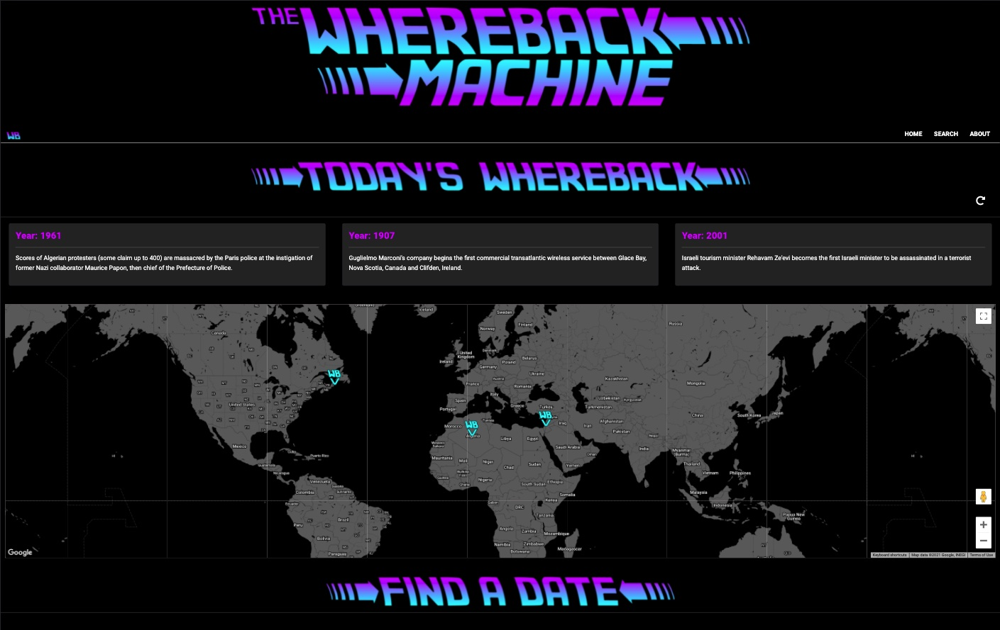
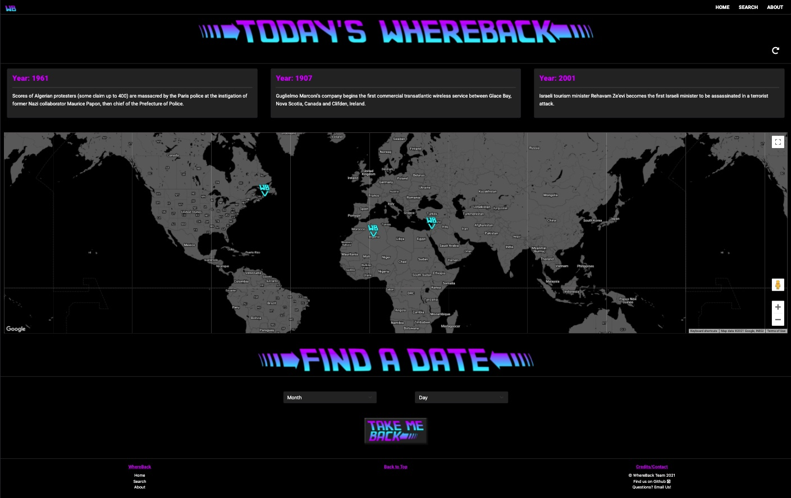
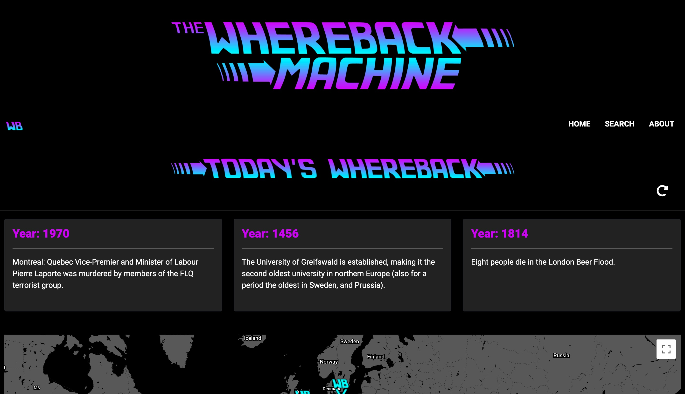
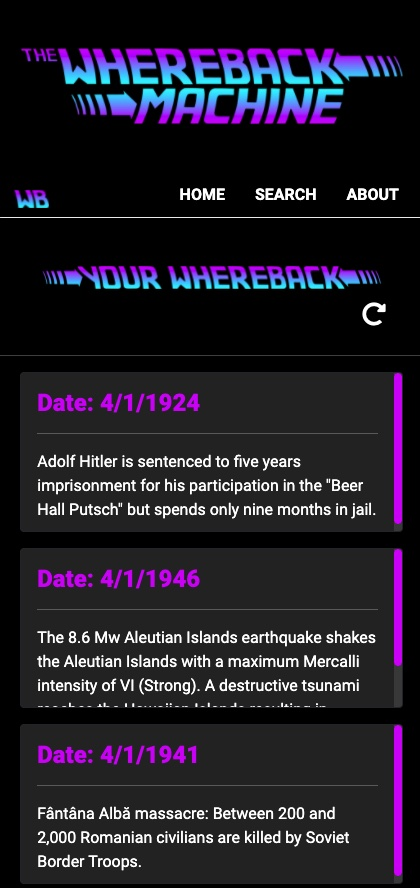

# WhereBack Machine
On this date in history, or on the date of your choosing, learn about historical events and where those locations are in the modern world. 





## Tech Stack 

- Languages:
    - Javascript
    - HTML
    - CSS
- APIs:
    - Google Maps API
    - Google Geocode API
    - WikiPedia, On this Day API
    - WikiPedia scrapes

- Bootstrap
- Flexbox
- AJAX

## MVP
 
Build a mobile responsive webpage that displays the data for this day in history and also allows the user to select a date of their choice. 
Use various API's to compile data on the event, it's historical location, and displays its modern day location using Google maps.


## Strech Goals

404 error catching page with dad jokes. Because dad jokes make everything better.

Dad jokes API

add in a travel api to show travel options to the location. 


## Code Snippets
```js
//
// Input link
// Output - 1) lat long in decimal (string), 2) country name (string), 3) null
function scrapeWikipedia(link) {
  return new Promise(async (res, _rej) => {
    try{
      const wikiPageBlock = await fetch(link);
      const wikiPageText = await wikiPageBlock.text();
      const parser = new DOMParser();
      const doc = parser.parseFromString(wikiPageText, "text/html");
      const infoBoxLabelList = doc.querySelectorAll(".infobox-label");
      let countryNode;
      // Checks to see if a country field exists to scrape coordinates
      infoBoxLabelList.forEach((element) => {
        if (element.textContent == "Country") {
          countryNode = element;
        }
        });
        // Option 1: Check Coordinates
        if (doc.querySelector(".geo")) {
          const coordString = doc.querySelector(".geo").textContent;
          const coordArr = coordString.split('; ')
          const lat = coordArr[0]
          const lng = coordArr[1]
          res({
            country: "",
            locationType: "coord",
            latlng: { lat, lng },
          });
        }
      // Option 2: Check Country
      else if (countryNode) {
        const countryParent = countryNode.parentNode;
        const countryParentLastChild = countryParent.lastChild;
        const country = countryParentLastChild.textContent;
        res({
          country,
          locationType: "country",
          latlng: { lat: "", lng: "" },
        });
        }
      // Option 3: Found Nothing
        else {
        res(null);
      }
    }catch (ex) {
      console.log(ex);
    }
  });
}
// Written by  Hunter Hutchisson and Victoria Walker
```
```js
// function to sort incoming Object data by location datatype and assign it a marker.
function sortObj(objArray){
    for(let i = 0; i < objArray.length; i++){
        let markerArr = [marker,marker2,marker3];
        if (objArray[i].locationType == 'country'){
            geocode({ address: objArray[i].country },markerArr[i]);
        }
        else if(objArray[i].locationType == 'coord'){
            let lat = objArray[i].latlng.lat;
            let long = objArray[i].latlng.lng;
            geocodeLatLng(geocoder, googleMap, infowindow, lat, long, markerArr[i]);
        }
    }   
};
//Written by Andrew Hatch
```


## Screenshots

Full-screen Content on Extra Large Screen Size


Whereback Page Content on Large Screen Size


Page Content on Extra Small Screen Size (e.g., mobile screen)



## Developers:

Victoria Walker : Googler-In-Chief, CSS BFF
https://github.com/v-walker
- Historical APIs Reasearch 
- Front End integration of Home and Search page including use of HTML, JavaScript, and CSS
- Responsive Design
- Site Accessibility Features


Hunter Hutchisson : Wiki Miester, Far Fetcher
https://github.com/hunterhutchisson
- Site functionality of initial search and user requested searches.
- Data fetching event info and geolocations by a combination of Historical APIs and Wikipedia webscraping.
- Search and Reset button functionality


Ryan Donald : Kernel Photoshop, Culture Vulture
https://github.com/ryanthomasdonald
- Front end development of landing/about page using HTML, CSS, and JavaScript
- Created custom assets with Adobe Photoshop


Andrew Hatch : Digital Cartographer, Documiester
https://github.com/AMHatch
- Google Maps API, and Google Geocode API integration
- Google Maps styling and customiztion


